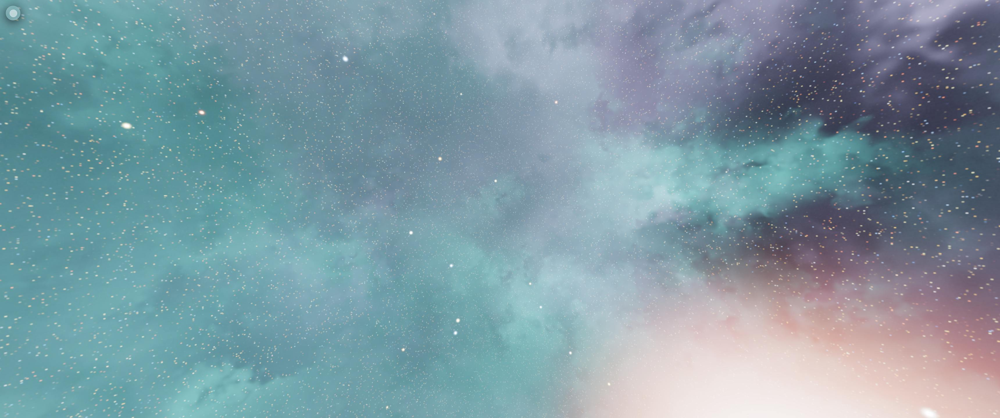

# Nebularity

A procedural 3D space nebula generator built with Three.js. 

This project is a modern refactor of the classic procedural nebula engine by **Joshua Hook (@wwwtyro)**. We've converted the pure WebGL boilerplate, to native a Three.js implementation featuring HDR rendering, PBR environment support, and reactive UI.

🚀 **[Nebula Drifter Game](https://manthrax.github.io/space-nebula/game/)**

🚀 **[Live Demo/Explorer](https://manthrax.github.io/space-nebula/)**

🚀 **[Minimal example](https://manthrax.github.io/space-nebula/example.html)**



## Nebula Drifter: Deep Space Explorer
The included game sub-project **Nebula Drifter** transforms the generator into a structured exploration experience:
- **Galactic Lattice Engine**: Traverse a deterministic 3D grid of star systems generated from a global seed.
- **3D Navigational Map**: A fully interactive, 3D star chart for plotting courses through the lattice.
- **Intelligent Autopilot**: A K-drive navigation computer that automatically handles orientation and hyperthrust jumps.
- **Persistence**: Your position, exploration history, and active flight paths are automatically saved to your browser.

## Library Usage

You can import **Nebularity** directly into any Three.js project via CDN.

### 1. Simple One-Liner (Static)
Perfect for quick background generation.
```javascript
import * as THREE from 'three';
import Nebularity from 'https://cdn.jsdelivr.net/gh/manthrax/space-nebula/src/Nebularity.js';

// Generate and automatically link to scene background/environment
Nebularity.create(THREE, renderer, "my-seed-123", {
    scene: scene,
    resolution: 1024,
    stars: true,
    nebulae: true
});
```

### 2. Stateful Morphing (Advanced)
Allows for smooth crossfades between different nebula states.
```javascript
import Nebularity from 'https://cdn.jsdelivr.net/gh/manthrax/space-nebula/src/Nebularity.js';

// 1. Initialize with optional scene and noise type ('simplex' or 'perlin')
const nebula = new Nebularity({ THREE, renderer, scene, noise: 'simplex' });

// 2. Morph to a new state over 2 seconds
nebula.morph("cosmic-voyage", { duration: 2.0 });

// 3. Update in your loop
function animate() {
    nebula.update(clock.getDelta());
    renderer.render(scene, camera);
}
```

## Features
- **Procedural Noise**: Toggle between **Classic Perlin** or **Simplex** noise to generate unique, infinitely varied cosmic clouds and dust patterns.
- **Astronomical Realism**: Star colors follow the **Morgan-Keenan spectral classification** (OBAFGKM), ranging from hot blue-white to cool red-orange.
- **PBR Environment Mapping**: Generated nebulas act as real-time environment maps, providing high-dynamic-range (HDR) lighting to 3D objects.
- **Modern UI**: A minimalist, translucent glassmorphism control panel with real-time parameter updates.
- **High Precision**: Renders to `HalfFloatType` (16-bit) buffers to eliminate color banding and preserve star intensity.

## Technical Credits
- **Original Algorithm**: [Joshua Hook (@wwwtyro)](https://github.com/wwwtyro).
- **Noise Core**: Based on Stefan Gustavson's classic 4D simplex noise implementation.
- **Refactor**: Modernized for ES6 and Three.js native rendering.

## Development
This project uses **Vite** for a fast development experience.

```bash
# Install dependencies
npm install

# Run locally
npm run dev
```

## Deployment
To deploy the interactive demo to GitHub Pages:

1. Ensure your code is pushed to a GitHub repository.
2. Run the deployment command:
```bash
npm run deploy
```
This will build the project and push the `dist` folder to the `gh-pages` branch.

## License
Released under the **Unlicense** (Public Domain). Feel free to use, modify, and distribute for any purpose.
